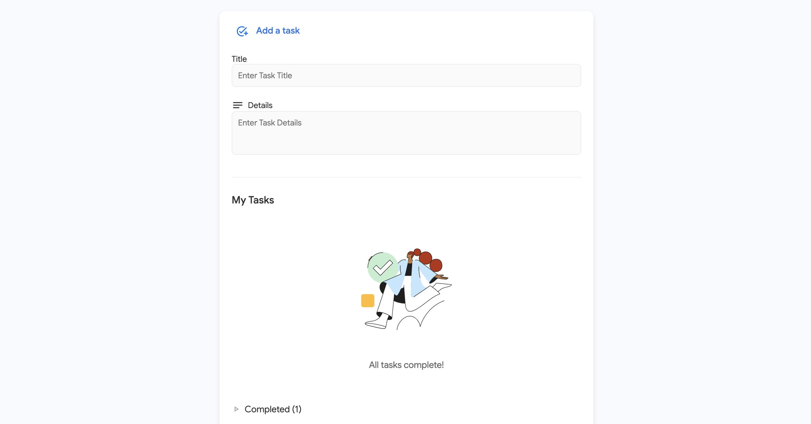

# **Google Tasks Replica Web App**

A feature-rich **Google Tasks replica** built with modern web technologies, designed to manage tasks with an intuitive **Material3-inspired design**. This app includes functionalities like adding, editing, deleting, and filtering tasks, providing a seamless and responsive user experience.

---

## **Features**

### 📝 **Task Management**
- **Add New Tasks**: Create tasks with customizable titles and descriptions.
- **Edit Tasks**: Update existing tasks with ease using a modal interface.
- **Delete Tasks**: Permanently remove tasks (there's an optional undo feature).
- **Mark as Completed**: Toggle tasks as completed or incomplete.
- **Dynamic Filtering**: Separate views for completed and incomplete tasks.

### 🎨 **Modern UI/UX**
- Built with **Material3 design principles** for a clean and consistent look.
- Responsive design that adapts to different screen sizes for desktop and mobile users.
- Smooth animations for an engaging user experience.

### 🌐 **Backend Integration**
- Powered by a **Django API** that connects to a **PostgreSQL database**.
- Fully supports RESTful CRUD operations.

### 🔍 **Additional Features**
- Toast notifications for user actions like task deletion and undo.
- Placeholder visuals with an SVG illustration when all tasks are completed, using official Google icons and assets to ensure **Material3 design consistency**.

---

## **Tech Stack**

### Frontend
- **React**: A fast and flexible library for building user interfaces.
- **CSS Modules**: Scoped styling with reusable components.
- **Material3 Design**: Inspired by Google's latest design principles.

### Backend
- **Django**: A robust and scalable backend framework.
- **PostgreSQL**: A reliable and efficient relational database.

---

## **Project Structure**

The project is organized into two main directories:

```plaintext
project-root/
│
├── backend/       # Django API for task management
│   ├── manage.py
│   ├── task_manager_api/
│   ├── tasks/
│   └── ...
│
├── frontend/      # React
│   ├── src/
│   ├── index.html
│   ├── package.json
│   └── ...
│
├── task-view-desktop.png  # Screenshot used in README
└── README.md      # Documentation
```

## **Screenshots**

### Home View


---

## **Future Improvements**

- **Dark Mode**: Introduce a dark theme for enhanced accessibility and user comfort during nighttime usage. The necessary assets for dark mode are already prepared, ensuring a smooth implementation process.

- **Drag-and-Drop Sorting**: Enable users to reorder tasks intuitively through drag-and-drop functionality, making task management more interactive and efficient.

- **Task Deadlines**: Add the ability to set due dates for tasks.

- **Customizable Task Lists**: Allow users to create, rename, and manage multiple task lists.

- **Enhanced Interface**: Develop a structured interface with a left-side navigation menu for easier access to different task lists and features. Add a profile picture or account management area on the right side of the interface to improve the user experience and personalization.

---

## **Contact**

This project is authored by **Kacper Stankiewicz**.  
[](https://www.linkedin.com/in/kacperstank)

---
